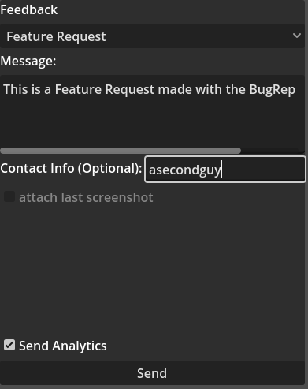

# BugReporter
The BugReporter allows players to send messages using a discord webhook.  
Webhooks can be easily abused for anonimous automated spam. That makes this a bad solution for games with many players.

# Config
This is an example config with all needed values. Only the url is needed. game_name will default to "unnamed_game" if not specified.

```
[webhook]

url="https://discord.com/api/webhooks/<webhook.id>/<webhook.token>"
game_name="BugReporter"
tts=false
color=15258703
```

The Reporter Node also gives the option to change the path to the config file, disable auto closing and disable auto clearing for inputs.

# Example usage

 
