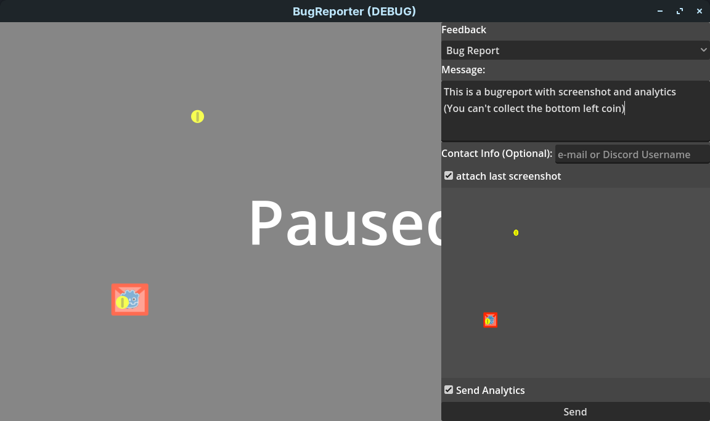

# BugReporter
The BugReporter allows players to send messages using a discord webhook.  
Webhooks can be easily abused for anonymous automated spam. That makes this a bad solution for games with many players.

# Config
This is an example config with all needed values. Only the url is needed. game_name will default to "unnamed_game" if not specified.

```
[webhook]

url="https://discord.com/api/webhooks/<webhook.id>/<webhook.token>"
game_name="BugReporter"
tts=false
color=15258703
anonymous_players=false
```

The Reporter Node also gives the option to change the path to the config file, disable auto closing and disable auto clearing for inputs.

<span style="color:red">**WARNING:** The webhook url can be used to read all messages send with the webhook.  
Do NOT use the url directly if you allow sending any non anonymous information.  
Using the url for anonymous messages is still highly discouraged.  
See Proxy section for save usage.
</span>

# Example usage

  

The playerid depends on the Game name and device id. This allows you to search reports by player but they are still mostly anonymous. You can disable this entirely with `anonymous_players=false`  
If not provided Contact Info will not be displayed.  
You can add or remove as many Categories as you like by editing the OptionButton of the Reporter.  
F2 takes a screenshot (configurable with the input action `screenshot`). The screenshot can be attached to the message.

# Analytics
Most of the time a screenshot is not enough to figure out what happened in a bugreport.  
To help with that you can allow your players to send analytics with their report.  
The Analytics Report will look something like this.  
```
Report-1692997835-Linux-16-3

root/Example
Example:<Node2D#27682407576>

root/Example/Player
pos: (539, 55), texture: res://icon.png
```
It starts with the Header `Report-Timestamp-OS name`  
Then it lists all nodes in the `analize` group by printing their full node path and the result of their `analize()` (Like root/Example/Player) function if they have one or the result of `_to_string()` (Like root/Example).  
You can put anything in here but you should beware of data protection laws.  

This can be enabled with `send_analytics` in the config file.
## log files
For an easyer to setup variant you can also just send the godot.log file. Again you should beware of data protection laws.

This can be enabled with `send_log` in the config file.
Make sure to enable `application/run/flush_stdout_on_print` in the Project settings. Otherwise the file will not always be written instantly. Then the log might miss lines at the end or be completely empty.
Also set `debug/file_logging/enable_file_logging` to make sure logs are written on non desktop platforms if needed.

# Customisation
## Message
The looks of the final Message can be entirely customized by changing the `send_report()` function in the `reporter.gd` script and using the `WebhookBuilder` provided with `_http`. 
## UI
The Reporter UI can be easily customized as long as the correct nodes are still provided in the main `Reporter` node.
## More specific questions
More information, questions etc can be freely added by first adding the input nodes (like buttons, LineEdit, etc.) and then adding the information to the message by adding a field, embed or whatever.


## Example survey
If you want feedback as more of a survey style format you can use `survey.tscn`
  [](screenshots/survey_message.png)

# Proxy
To prevent data leaks and potential data privacy lawsuits you need to setup a proxy.
A Proxy will relay any messages to discord while ignoring unwanted actions (reading, deleting etc.).  

The recomended way is to use a cloudflare worker with this code. Then put the proxy url in the webhook.cfg instead of the webhook url.
```js
export default {
  async fetch(request) {
    const destinationURL = "webhook url";
    if (request.method === "POST") {
      const mod = await fetch(destinationURL, request);
      return new Response(null, {status: mod.status});
    }
    return new Response("Only POST is allowed", { status: 403 });
  },
};
```

Make sure the webhook url is only in this code to make sure nobody malicius can get a hold of it.  
If you want to implement a content filter or spam prevention this would be a good place to do it.

